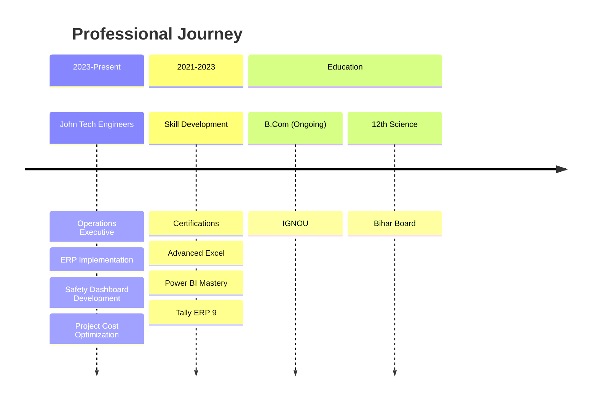

# 💼 Roushan Kumar Gupta  
### Operations & Project Management Executive  
#### *Bridging Construction Expertise with Tech-Driven Solutions*  

---

<div align="center">


</div>

---

## 📊 Professional Dashboard

<div align="center">

| **Metric** | **Status** | **Progress** |
|------------|------------|--------------|
| **Project Completion** | 98% |  |
| **Cost Optimization** | 94% |  |
| **Safety Compliance** | 100% |  |
| **Tech Integration** | 96% |  |

</div>

---

## 🎯 Core Competencies Matrix

<div align="center">

```mermaid
quadrantChart
    title "Expertise Quadrant Analysis"
    x-axis "Construction Focus" → "Tech Focus"
    y-axis "Operational" → "Strategic"
    "Project Management": [0.7, 0.8]
    "Safety Compliance": [0.6, 0.9]
    "Data Analytics": [0.9, 0.7]
    "ERP Systems": [0.85, 0.6]
    "Site Operations": [0.4, 0.8]
    "Process Automation": [0.9, 0.5]
```

</div>

---

## 🛠️ Tech Stack & Tools

### 📊 **Data & Analytics**
<div align="center">


</div>

### 🏗️ **ERP & Business Systems**
<div align="center">


</div>

### 📈 **Productivity Suite**
<div align="center">


</div>

---

## 🏆 Project Highlights

<div class="project-grid" align="center">

| **Project** | **Type** | **Role** | **Tech Used** | **Impact** |
|-------------|----------|----------|---------------|------------|
| **Industrial Scaffolding** | Construction | Lead Manager | Excel, Power BI | 30% Time Reduction |
| **ERP Implementation** | Digital Transformation | Coordinator | Tally, Zoho | 25% Cost Saving |
| **Safety Dashboard** | Analytics | Developer | Power BI, SQL | 40% Compliance↑ |
| **Automated Reporting** | Process Automation | Architect | Excel, Power Query | 20hrs/week Saved |

</div>

---

## 📈 Experience Timeline



---

## 🎓 Education & Certifications

<div class="cert-grid" align="center">

| **Qualification** | **Institution** | **Year** | **Status** |
|-------------------|-----------------|----------|------------|
| **B.Com** | IGNOU | 2025 (Expected) | 🟢 In Progress |
| **12th Science** | Bihar Board | 2021 | ✅ Completed |
| **Process Safety Management** | Skill India (NSDC) | 2023 | 🏅 Certified |
| **Power BI Advanced** | Microsoft Learn | 2023 | 🏅 Certified |
| **Tally ERP + GST** | Tally Academy | 2023 | 🏅 Certified |

</div>

---

## 📊 GitHub Analytics

<div align="center">


</div>

---

## 🌟 Featured Projects

<div class="projects-showcase" align="center">

### 🏗️ **Project Management Dashboard**

*Real-time project tracking with Power BI*

### 📊 **Safety Compliance System**

*Automated safety monitoring and reporting*

### 💼 **ERP Integration Module**

*Seamless Tally to Power BI integration*

</div>

---

## 📞 Connect With Me

<div align="center">

[](https://linkedin.com/in/roushan-kumar-7bb400239)
[](mailto:roushank2515@gmail.com)
[](https://instagram.com/roushan.dev01)
[](https://github.com/roushan62)
[](https://roushan62.github.io)

</div>

---

## 📬 Let's Collaborate

<div align="center">

```yaml
available_for: 
  - Full-time Positions
  - Project Consultancy
  - ERP Implementation
  - Dashboard Development
  - Process Automation
  
preferred_domains:
  - Construction Tech
  - Industrial Operations
  - Project Management
  - Business Intelligence
  - Operational Excellence
  
location: Gujarat, India (Open to Relocation)
status: Actively Seeking Opportunities
response_time: Within 24 hours
```

</div>

---

<div align="center">


**"Transforming Construction Operations with Data-Driven Intelligence"**

⭐ *Star my repositories if you find them useful!*  
📧 *Feel free to reach out for collaboration or opportunities*

</div>

---

*Last Updated: January 2024 | Profile Version: 2.0 | Theme: Professional Tech-Blue*

<style>
  .project-grid, .cert-grid {
    display: grid;
    grid-template-columns: repeat(auto-fit, minmax(300px, 1fr));
    gap: 20px;
    margin: 30px 0;
  }
  
  .projects-showcase {
    display: flex;
    flex-wrap: wrap;
    justify-content: center;
    gap: 20px;
    margin: 30px 0;
  }
</style>
