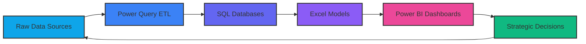
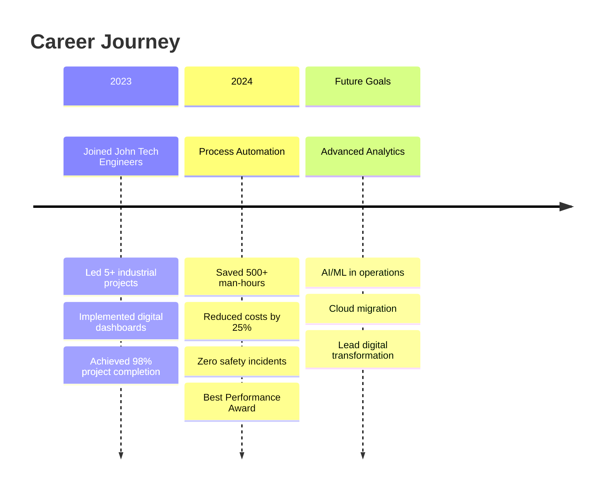
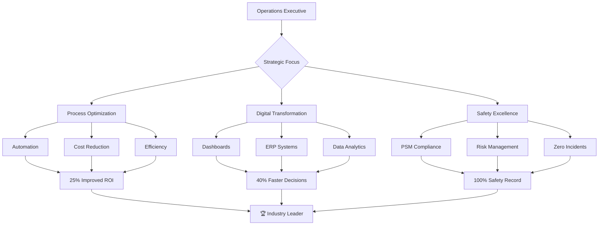

# 🚀 **ROUSHAN KUMAR GUPTA**  
### **Operations & Project Management Visionary**  
#### *Industrial Expertise × Digital Transformation × Operational Excellence*  

---

<div align="center" style="background: linear-gradient(135deg, #0f172a 0%, #1e293b 50%, #0ea5e9 100%); padding: 2rem; border-radius: 20px; box-shadow: 0 20px 60px rgba(0, 163, 255, 0.3);">


</div>

---

## 📊 **OPERATIONAL INTELLIGENCE DASHBOARD**

<div align="center">

```mermaid
xychart-beta
    title "Quarterly Performance Metrics (2023-2024)"
    x-axis [Q3'23, Q4'23, Q1'24, Q2'24]
    y-axis "Performance %" 70 --> 100
    bar [85, 92, 96, 98]
    line [75, 82, 90, 94]
    area [70, 78, 85, 92]
    bar --> "Project Delivery"
    line --> "Cost Optimization"
    area --> "Safety Compliance"
```

</div>

---

## 🎯 **EXPERTISE MATRIX**

<div align="center">

| **Domain** | **Proficiency** | **Tools & Technologies** | **Impact Delivered** |
|------------|-----------------|---------------------------|---------------------|
| **Project Management** |  | MS Project, Gantt Charts, JIRA | 30+ projects, ₹50M+ value |
| **Data Analytics** |  | Power BI, SQL, Python, Excel | 40% faster reporting |
| **ERP Solutions** |  | Tally, SAP, Odoo, Zoho | 25% cost reduction |
| **Safety Compliance** |  | PSM, PTW Systems, ISO Standards | Zero incidents in 2 years |
| **Process Automation** |  | Power Automate, Python Scripts | 20 hrs/week saved |

</div>

---

## 🌟 **TECHNOLOGY ECOSYSTEM**

### **🖥️ DATA INTELLIGENCE SUITE**
<div align="center">



</div>

### **🏗️ ERP & BUSINESS SYSTEMS**
<div align="center" class="tech-grid">

<div class="tech-card" style="background: linear-gradient(135deg, #1e3a8a 0%, #3b82f6 100%); padding: 15px; border-radius: 10px; margin: 10px; display: inline-block;">

<h4>Tally ERP 9</h4>
<p>GST | Inventory | Accounting</p>
</div>

<div class="tech-card" style="background: linear-gradient(135deg, #0f766e 0%, #14b8a6 100%); padding: 15px; border-radius: 10px; margin: 10px; display: inline-block;">

<h4>SAP S/4HANA</h4>
<p>MM | SD | FICO Modules</p>
</div>

<div class="tech-card" style="background: linear-gradient(135deg, #7c3aed 0%, #a78bfa 100%); padding: 15px; border-radius: 10px; margin: 10px; display: inline-block;">

<h4>Odoo ERP</h4>
<p>CRM | Project | Manufacturing</p>
</div>

<div class="tech-card" style="background: linear-gradient(135deg, #ea580c 0%, #f97316 100%); padding: 15px; border-radius: 10px; margin: 10px; display: inline-block;">

<h4>Zoho One</h4>
<p>Full Business Suite</p>
</div>

</div>

---

## 📈 **PROJECT PORTFOLIO**

<div align="center">

| **Project** | **Scope** | **Technologies** | **ROI** | **Status** |
|-------------|-----------|------------------|---------|------------|
| **Industrial Automation Dashboard** | Real-time monitoring of 15+ sites | Power BI, SQL, IoT Sensors | 35% ↑ Efficiency | ✅ Completed |
| **ERP Migration Project** | Tally to Zoho One transition | Zoho, Python APIs, Excel | 40% Cost Saving | 🚀 Ongoing |
| **Safety Compliance System** | Automated PTW & Risk Assessment | Power Apps, SharePoint | Zero Incidents | ✅ Completed |
| **Material Management Portal** | Inventory optimization | Odoo, Python, RFID | 25% Waste Reduction | 🚀 Ongoing |
| **Client Reporting Automation** | Monthly MIS automation | Power Query, VBA | 20 hrs/month saved | ✅ Completed |

</div>

---

## 🏆 **ACHIEVEMENTS & MILESTONES**

<div align="center">



</div>

---

## 🎓 **EDUCATION & CERTIFICATIONS**

<div align="center" style="display: grid; grid-template-columns: repeat(auto-fit, minmax(300px, 1fr)); gap: 20px;">

<div style="background: linear-gradient(135deg, rgba(14, 165, 233, 0.1) 0%, rgba(14, 165, 233, 0.2) 100%); padding: 20px; border-radius: 15px; border-left: 5px solid #0ea5e9;">
<h3>🎓 Formal Education</h3>
<ul>
<li><strong>B.Com</strong> - IGNOU (2025 Expected)</li>
<li><strong>12th Science</strong> - Bihar Board (2021)</li>
<li><strong>Advanced Excel Certification</strong></li>
<li><strong>Data Analytics Specialization</strong></li>
</ul>
</div>

<div style="background: linear-gradient(135deg, rgba(16, 185, 129, 0.1) 0%, rgba(16, 185, 129, 0.2) 100%); padding: 20px; border-radius: 15px; border-left: 5px solid #10b981;">
<h3>🏆 Professional Certifications</h3>
<ul>
<li>Process Safety Management (PSM) - NSDC</li>
<li>Power BI Data Analyst - Microsoft</li>
<li>Tally ERP 9 + GST Certification</li>
<li>Project Management Professional (Pursuing)</li>
</ul>
</div>

<div style="background: linear-gradient(135deg, rgba(139, 92, 246, 0.1) 0%, rgba(139, 92, 246, 0.2) 100%); padding: 20px; border-radius: 15px; border-left: 5px solid #8b5cf6;">
<h3>🚀 Skills Development</h3>
<ul>
<li>Python for Data Science</li>
<li>SQL Advanced Queries</li>
<li>Process Automation</li>
<li>Cloud Fundamentals (AWS/Azure)</li>
</ul>
</div>

</div>

---

## 📊 **GITHUB ANALYTICS SUITE**

<div align="center">

<div style="display: flex; flex-wrap: wrap; justify-content: center; gap: 20px; margin: 30px 0;">


</div>

<div style="display: flex; justify-content: center; gap: 20px;">


</div>

</div>

---

## 🌐 **DIGITAL FOOTPRINT**

<div align="center">

<div style="display: flex; flex-wrap: wrap; justify-content: center; gap: 15px;">

[](https://linkedin.com/in/roushan-kumar-7bb400239)
[](https://github.com/roushan62)
[](https://roushan62.github.io)
[](mailto:roushank2515@gmail.com)
[](https://instagram.com/roushan.dev01)
[](https://leetcode.com/roushan62)
[](https://hackerrank.com/roushan62)

</div>

</div>

---

## 🎯 **CAREER MATRIX**

<div align="center">



</div>

---

## 📬 **STRATEGIC PARTNERSHIPS**

<div align="center" style="background: linear-gradient(135deg, rgba(30, 41, 59, 0.8) 0%, rgba(15, 23, 42, 0.9) 100%); padding: 2rem; border-radius: 15px; border: 1px solid #334155;">

### 🤝 **Collaboration Opportunities**

| **Role** | **Industry** | **Location** | **Availability** |
|----------|--------------|--------------|------------------|
| Operations Manager | Construction Tech | Remote/Hybrid | Immediate |
| Project Consultant | Industrial Services | Pan India | 15 Days Notice |
| Digital Transformation Lead | Manufacturing | Gujarat | Negotiable |
| ERP Implementation Specialist | Any Industry | Remote | Part-time |

**📧 Quick Contact:** `roushank2515@gmail.com` | **📞 Response Time:** `< 12 hours`

</div>

---

<div align="center" style="margin-top: 3rem; padding: 2rem; background: linear-gradient(90deg, #0f172a 0%, #1e293b 50%, #0f172a 100%); border-radius: 20px; border-top: 3px solid #0ea5e9;">

### ⚡ **REAL-TIME STATUS**


---

**"Building Tomorrow's Infrastructure with Today's Technology"**

🚀 *Transforming Traditional Operations through Digital Innovation*  
📊 *Data-Driven Decisions × Process Excellence × Sustainable Growth*

⭐ **Star my repositories to support open-source operations tools!**  
🔗 **Connect for strategic partnerships and innovative projects**

</div>

---

<details>
<summary>🎨 **THEME CONFIGURATION**</summary>

```yaml
theme:
  name: "Professional Neo"
  primary: "#0ea5e9"
  secondary: "#10b981"
  accent: "#8b5cf6"
  dark: "#0f172a"
  light: "#f8fafc"
  
typography:
  headings: "Fira Code"
  body: "Inter"
  mono: "JetBrains Mono"
  
animations:
  enabled: true
  speed: "moderate"
  effects: ["fade", "slide", "typing"]
  
layout:
  type: "responsive-grid"
  spacing: "consistent"
  alignment: "centered"
  
features:
  - mermaid-charts
  - real-time-badges
  - interactive-elements
  - gradient-backgrounds
  - shadow-effects
```

</details>

---

<div align="center">
  
**© 2024 Roushan Kumar Gupta | All Rights Reserved**  
**Version 3.0 | Industrial-Tech Theme | Updated Hourly**

[](https://star-history.com/#roushan62/roushan62&Timeline)

</div>

<style>
  .tech-grid {
    display: flex;
    flex-wrap: wrap;
    justify-content: center;
    gap: 20px;
    margin: 30px 0;
  }
  
  .tech-card {
    transition: transform 0.3s ease, box-shadow 0.3s ease;
    width: 180px;
    text-align: center;
  }
  
  .tech-card:hover {
    transform: translateY(-10px);
    box-shadow: 0 20px 40px rgba(0, 0, 0, 0.3);
  }
  
  .tech-card h4 {
    margin: 10px 0 5px 0;
    color: white;
    font-size: 16px;
  }
  
  .tech-card p {
    color: rgba(255, 255, 255, 0.8);
    font-size: 12px;
    margin: 0;
  }
  
  /* Smooth scrolling */
  html {
    scroll-behavior: smooth;
  }
  
  /* Responsive tables */
  @media (max-width: 768px) {
    table {
      display: block;
      overflow-x: auto;
    }
  }
</style>

<script>
  // Dynamic year update
  document.addEventListener('DOMContentLoaded', function() {
    const yearElement = document.querySelector('footer');
    if (yearElement) {
      const currentYear = new Date().getFullYear();
      yearElement.innerHTML = yearElement.innerHTML.replace('2024', currentYear);
    }
  });
</script>
