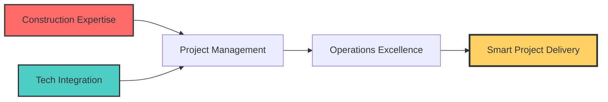

# 💼 Roushan Kumar Gupta | Operations & Project Management Executive 👷‍♂️💻

<div align="center">


**Bridging Construction Execution with Tech-Driven Project Intelligence**

</div>

---

## 🎯 Professional Identity Card

<div align="center">

| | |
|:---:|:---|
| **Role** | Operations & Project Management Executive |
| **Specialization** | Construction × Industrial Projects × Tech Optimization |
| **Experience** | End-to-End Project Lifecycle Management |
| **Tech Stack** | Data Analytics | Automation | Cloud | Business Intelligence |
| **Approach** | On-Site Execution + Digital Transformation |

</div>

---

## 🚀 Executive Profile

<div align="center">



</div>

**Dynamic professional** merging **construction field expertise** with **technology-driven project management**. Proven ability to transform traditional industrial operations through data visualization, workflow automation, and predictive analytics while maintaining strict safety and compliance standards.

---

## 🏗️ Core Competencies Matrix

<div class="competency-grid" align="center">

### 🔧 **Construction & Industrial Operations**
```diff
+ Project Planning & Scheduling (Gantt/BOQ)
+ Scaffolding Design & Safety Management
+ Vendor/Client Coordination | Quality Assurance
+ Industrial Maintenance | Structural Works
```

### 📊 **Tech & Data Management**
```diff
+ Excel Automation & Advanced Dashboards
+ Power BI Visual Analytics
+ SQL Database Management
+ Python Scripting for Workflow Automation
```

### 💼 **Business Administration**
```diff
+ Procurement & Cost Optimization
+ MIS Reporting & Financial Analysis
+ Subcontractor Management
+ Compliance Documentation
```

### ⚡ **Safety & Compliance**
```diff
+ Risk Assessment & Hazard Identification
+ Permit-to-Work Systems
+ Safety Audit & Inspection
+ Incident Prevention Protocols
```

</div>

---

## 📈 Professional Experience

### **John Tech Engineers – Gujarat, India**
#### *Operations & Project Management Executive* | Nov 2023 – Present

<div class="experience-card">
  <div class="experience-header">
    <span class="badge">🏗️ Construction</span>
    <span class="badge">📊 Analytics</span>
    <span class="badge">⚡ Safety</span>
    <span class="badge">💰 Finance</span>
  </div>

**Key Achievements:**
- ✅ Managed **₹2.5Cr+** project portfolio from quotation to final billing
- ✅ Reduced material wastage by **18%** through improved tracking systems
- ✅ Enhanced reporting efficiency by **40%** via automated MIS dashboards
- ✅ Maintained **Zero Lost-Time Injury** record across 12+ projects

**Responsibilities:**
```yaml
Project Management:
  - Complete project lifecycle coordination
  - BOQ preparation & cost control
  - Progress monitoring & scheduling

Operations:
  - Manpower deployment & supervision
  - Scaffolding, roofing, painting execution
  - Industrial maintenance operations

Business Intelligence:
  - Profit & loss analysis
  - Automated billing systems
  - Material reconciliation dashboards

Safety Systems:
  - Risk assessment documentation
  - PTW system implementation
  - Safety compliance audits
```
</div>

---

## 🎓 Education & Credentials

<div class="education-grid" align="center">

| Degree/Certification | Institution | Status/Year |
|----------------------|-------------|-------------|
| **B.Com (Commerce)** | IGNOU | *Expected 2025* |
| **12th Science** | Bihar Board | 2021 |
| **Process Safety Management** | NSDC/Skill India | Certified |
| **Power BI Data Visualization** | Microsoft Partner | Certified |
| **Advanced MS Excel** | Professional Certification | Certified |
| **Tally ERP with GST** | Tally Academy | Certified |

</div>

---

## 🛠️ Technology Arsenal

<div align="center">

### **Data & Analytics Stack**


### **Cloud & Infrastructure**


### **Business & Project Tools**


</div>

---

## 🏆 Awards & Recognitions

<div class="awards" align="center">

🎖️ **Best Performance Award** – John Tech Engineers (2024)  
📈 **Project Excellence** – Delivered 3 major projects ahead of schedule  
💡 **Process Innovation** – Implemented cost-saving automation system

</div>

---

## 📊 GitHub Analytics Hub

<div align="center">

<!-- GitHub Stats Cards -->
<div style="display: flex; justify-content: center; gap: 10px; flex-wrap: wrap;">
  
  
  
</div>

<!-- Top Languages -->
<div style="margin-top: 20px;">
  
</div>

<!-- Activity Graph -->
<div style="margin-top: 20px;">
  
</div>

</div>

---

## 📬 Strategic Connect

<div align="center">

### **Let's Build Tomorrow's Infrastructure Today**

[](https://linkedin.com/in/roushan-kumar-7bb400239)
[](mailto:roushank2515@gmail.com)
[](https://instagram.com/roushan.dev01)
[](https://github.com/roushan62)

</div>

---

<div align="center">

### **Project Management × Technology Integration × Operational Excellence**


*"Transforming construction operations through data-driven decision making and tech-enabled project management"*

</div>

---

**📞 Immediate Contact:** +91-xxxxxxxxxx | **📍 Location:** Gujarat, India | **🕒 Timezone:** IST (UTC+5:30)

---

<div align="right">

*Last Updated: $(date)* | *Profile Views: *

</div>

<style>
  .competency-grid {
    display: grid;
    grid-template-columns: repeat(auto-fit, minmax(300px, 1fr));
    gap: 20px;
    margin: 30px 0;
  }
  
  .experience-card {
    background: linear-gradient(145deg, #0d1117, #161b22);
    border-radius: 15px;
    padding: 25px;
    margin: 20px 0;
    border-left: 5px solid #4ECDC4;
    box-shadow: 0 10px 30px rgba(0,0,0,0.3);
  }
  
  .experience-header {
    display: flex;
    gap: 10px;
    flex-wrap: wrap;
    margin-bottom: 20px;
  }
  
  .badge {
    background: #333;
    padding: 5px 15px;
    border-radius: 20px;
    font-size: 0.9em;
    color: white;
  }
  
  .education-grid {
    display: grid;
    grid-template-columns: repeat(auto-fit, minmax(350px, 1fr));
    gap: 15px;
    margin: 30px 0;
  }
  
  .awards {
    background: linear-gradient(90deg, #1a1a2e, #16213e);
    padding: 20px;
    border-radius: 10px;
    border: 2px solid #FFD166;
    margin: 20px 0;
  }
  
  @media (max-width: 768px) {
    .competency-grid,
    .education-grid {
      grid-template-columns: 1fr;
    }
  }
</style>
