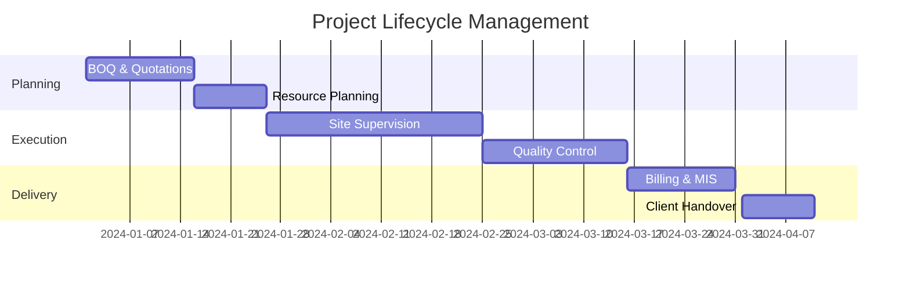

# 💼 Roushan Kumar Gupta  
### Operations & Project Management Executive 👷‍♂️💻  
`Construction | Industrial Maintenance | Tech-Driven Operations`

<div align="center">

&border=2&borderColor=00d4ff&pattern=topography&animation=slideIn)

</div>

---

## 🚀 Professional Summary
<div align="center">

```javascript
const profile = {
  role: "Operations & Project Management Executive",
  expertise: [
    "End-to-End Project Management",
    "Industrial & Construction Operations",
    "Tech-Driven Automation & Dashboards",
    "Safety & Compliance Systems"
  ],
  approach: "Bridging on-site construction expertise with digital transformation",
  techStack: ["Excel", "Power BI", "SQL", "ERP Systems", "Dashboard Automation"]
};
```

</div>

---

## 🛠️ **Core Competencies Dashboard**

### 📊 **Project & Operations Management**


### 🏗️ **Construction Expertise**
<div class="skills-grid">
  <div class="skill-item">Scaffolding Design & Safety</div>
  <div class="skill-item">Industrial Insulation</div>
  <div class="skill-item">Structural Maintenance</div>
  <div class="skill-item">Roofing & Painting</div>
  <div class="skill-item">Material Management</div>
  <div class="skill-item">Vendor Coordination</div>
</div>

### 🔐 **Safety & Compliance**
<div class="progress-container">
  <div class="progress-bar" style="width: 95%; background: linear-gradient(90deg, #4CAF50, #8BC34A);">
    <span>Risk Assessment & PTW Systems</span>
  </div>
  <div class="progress-bar" style="width: 90%; background: linear-gradient(90deg, #2196F3, #03A9F4);">
    <span>Site Safety Audits</span>
  </div>
  <div class="progress-bar" style="width: 92%; background: linear-gradient(90deg, #FF9800, #FFC107);">
    <span>PPE Compliance</span>
  </div>
  <div class="progress-bar" style="width: 88%; background: linear-gradient(90deg, #9C27B0, #E91E63);">
    <span>Incident Prevention</span>
  </div>
</div>

---

## 💻 **Tech Stack & ERP Mastery**

### 📈 **Data & Analytics Suite**
<div align="center">

| Tool | Expertise Level | Primary Use |
|------|----------------|-------------|
|  | ⭐⭐⭐⭐⭐ | Automation, Dashboards, Cost Sheets |
|  | ⭐⭐⭐⭐☆ | Operational Dashboards, KPI Tracking |
|  | ⭐⭐⭐☆☆ | Data Querying, Reporting |
|  | ⭐⭐⭐⭐☆ | ETL, Data Transformation |

</div>

### 🏢 **ERP & Business Systems**
<div class="erp-grid">
  <div class="erp-card tally">
    <h4>Tally ERP / Prime</h4>
    <p>Accounting, GST, Inventory</p>
  </div>
  <div class="erp-card sap">
    <h4>SAP</h4>
    <p>Enterprise Resource Planning</p>
  </div>
  <div class="erp-card zoho">
    <h4>Zoho One</h4>
    <p>Integrated Business Suite</p>
  </div>
  <div class="erp-card odoo">
    <h4>Odoo ERP</h4>
    <p>Open Source ERP</p>
  </div>
  <div class="erp-card oracle">
    <h4>Oracle</h4>
    <p>Database & ERP Solutions</p>
  </div>
  <div class="erp-card quickbooks">
    <h4>QuickBooks</h4>
    <p>Accounting & Finance</p>
  </div>
</div>

---

## 💼 **Professional Experience**

<div class="timeline">
  <div class="timeline-item">
    <div class="timeline-date">Nov 2023 – Present</div>
    <div class="timeline-content">
      <h3>John Tech Engineers – Gujarat, India</h3>
      <h4>Operations & Project Management Executive</h4>
      
      <div class="achievements">
        <div class="achievement">
          <span class="icon">📊</span>
          <span>Managed full project lifecycle from quotation to billing</span>
        </div>
        <div class="achievement">
          <span class="icon">👷</span>
          <span>Supervised scaffolding, roofing, painting & industrial maintenance projects</span>
        </div>
        <div class="achievement">
          <span class="icon">📈</span>
          <span>Developed MIS dashboards for cost monitoring & P&L tracking</span>
        </div>
        <div class="achievement">
          <span class="icon">⚠️</span>
          <span>Implemented safety protocols, PTW systems & risk assessments</span>
        </div>
      </div>
    </div>
  </div>
</div>

---

## 🎓 **Education & Certifications**

<div class="education-grid">
  <div class="edu-card">
    <h3>🎓 B.Com (Commerce)</h3>
    <p>IGNOU, India</p>
    <span class="status">Expected 2025</span>
  </div>
  <div class="edu-card">
    <h3>🔬 12th (Science Stream)</h3>
    <p>Bihar School Examination Board</p>
    <span class="year">2021</span>
  </div>
</div>

### 📜 **Certifications**
<div class="cert-grid">
  <div class="cert-badge">Process Safety Management (PSM)</div>
  <div class="cert-badge">Advanced MS Excel</div>
  <div class="cert-badge">Power BI Data Visualization</div>
  <div class="cert-badge">Tally ERP & GST</div>
  <div class="cert-badge">ADCA</div>
  <div class="cert-badge highlight">🏆 Best Performance Award</div>
</div>

---

## 📊 **GitHub Analytics**

<div align="center">


</div>

---

## 🌐 **Connect With Me**

<div align="center">

[](https://linkedin.com/in/roushan-kumar-7bb400239)
[](https://instagram.com/roushan.dev01)
[](mailto:roushank2515@gmail.com)
[](#)

</div>

---

<div align="center">

### 🚀 **Currently Working On**
`Industrial Project Automation` | `Power BI Dashboards` | `ERP Integration` | `Safety Compliance Systems`


</div>

<style>
  .skills-grid, .erp-grid, .education-grid, .cert-grid {
    display: grid;
    gap: 15px;
    margin: 20px 0;
  }
  
  .skills-grid {
    grid-template-columns: repeat(auto-fit, minmax(200px, 1fr));
  }
  
  .skill-item {
    background: linear-gradient(135deg, #2c3e50, #4ca1af);
    padding: 12px;
    border-radius: 8px;
    text-align: center;
    color: white;
    font-weight: bold;
    transition: transform 0.3s;
  }
  
  .skill-item:hover {
    transform: translateY(-5px);
    box-shadow: 0 10px 20px rgba(0,0,0,0.2);
  }
  
  .progress-container {
    background: #1e1e1e;
    border-radius: 10px;
    padding: 20px;
    margin: 20px 0;
  }
  
  .progress-bar {
    height: 25px;
    border-radius: 12px;
    margin: 10px 0;
    display: flex;
    align-items: center;
    padding: 0 15px;
    color: white;
    font-weight: bold;
    position: relative;
    overflow: hidden;
  }
  
  .progress-bar::after {
    content: '';
    position: absolute;
    top: 0;
    left: 0;
    right: 0;
    bottom: 0;
    background: linear-gradient(90deg, transparent, rgba(255,255,255,0.2), transparent);
    animation: shine 2s infinite;
  }
  
  @keyframes shine {
    0% { transform: translateX(-100%); }
    100% { transform: translateX(100%); }
  }
  
  .erp-grid {
    grid-template-columns: repeat(auto-fit, minmax(180px, 1fr));
  }
  
  .erp-card {
    padding: 20px;
    border-radius: 10px;
    color: white;
    text-align: center;
    transition: all 0.3s;
    cursor: pointer;
  }
  
  .erp-card:hover {
    transform: scale(1.05);
    box-shadow: 0 10px 25px rgba(0,0,0,0.3);
  }
  
  .tally { background: linear-gradient(135deg, #FF6F61, #FF8A65); }
  .sap { background: linear-gradient(135deg, #000000, #434343); }
  .zoho { background: linear-gradient(135deg, #F0652A, #FF8A00); }
  .odoo { background: linear-gradient(135deg, #EE6A56, #FF8A80); }
  .oracle { background: linear-gradient(135deg, #F80000, #FF5252); }
  .quickbooks { background: linear-gradient(135deg, #36B15C, #4CAF50); }
  
  .timeline {
    border-left: 3px solid #00d4ff;
    padding-left: 30px;
    margin: 40px 0;
  }
  
  .timeline-item {
    margin: 30px 0;
    position: relative;
  }
  
  .timeline-item::before {
    content: '';
    position: absolute;
    left: -36px;
    top: 0;
    width: 15px;
    height: 15px;
    border-radius: 50%;
    background: #00d4ff;
    border: 3px solid #0d1117;
  }
  
  .timeline-date {
    background: #00d4ff;
    color: #0d1117;
    padding: 5px 15px;
    border-radius: 20px;
    display: inline-block;
    font-weight: bold;
    margin-bottom: 10px;
  }
  
  .achievements {
    display: grid;
    gap: 10px;
    margin-top: 15px;
  }
  
  .achievement {
    display: flex;
    align-items: center;
    gap: 10px;
    padding: 10px;
    background: rgba(0, 212, 255, 0.1);
    border-radius: 8px;
    border-left: 3px solid #00d4ff;
  }
  
  .education-grid {
    grid-template-columns: repeat(auto-fit, minmax(250px, 1fr));
  }
  
  .edu-card {
    background: linear-gradient(135deg, #1a2980, #26d0ce);
    padding: 20px;
    border-radius: 10px;
    color: white;
  }
  
  .status, .year {
    background: rgba(255,255,255,0.2);
    padding: 3px 10px;
    border-radius: 15px;
    font-size: 0.9em;
    display: inline-block;
    margin-top: 10px;
  }
  
  .cert-grid {
    grid-template-columns: repeat(auto-fit, minmax(200px, 1fr));
  }
  
  .cert-badge {
    background: linear-gradient(135deg, #667eea, #764ba2);
    padding: 12px;
    border-radius: 25px;
    text-align: center;
    color: white;
    font-weight: bold;
  }
  
  .cert-badge.highlight {
    background: linear-gradient(135deg, #f093fb, #f5576c);
    animation: pulse 2s infinite;
  }
  
  @keyframes pulse {
    0% { box-shadow: 0 0 0 0 rgba(245, 87, 108, 0.7); }
    70% { box-shadow: 0 0 0 10px rgba(245, 87, 108, 0); }
    100% { box-shadow: 0 0 0 0 rgba(245, 87, 108, 0); }
  }
  
  h1, h2, h3, h4 {
    background: linear-gradient(90deg, #00d4ff, #0088cc);
    -webkit-background-clip: text;
    background-clip: text;
    color: transparent;
  }
</style>
