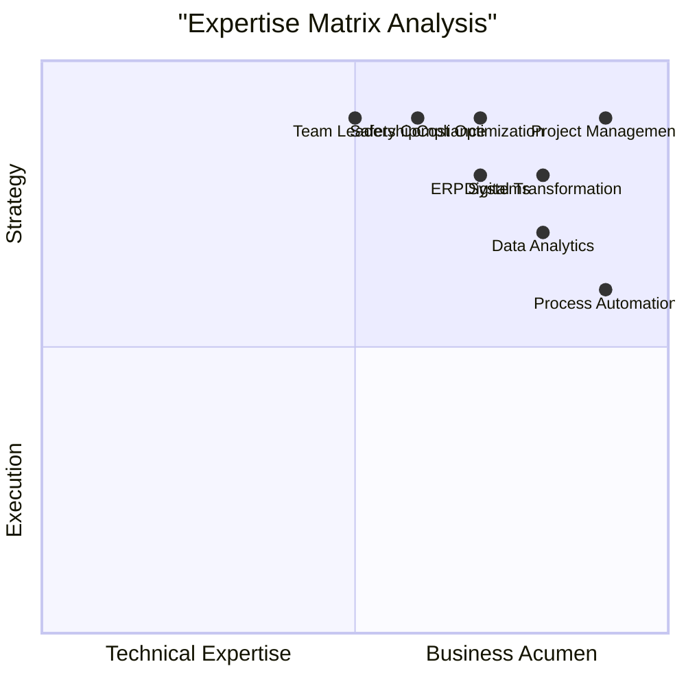

# 🚀 **ROUSHAN KUMAR GUPTA**  
## **OPERATIONS EXCELLENCE ARCHITECT**  
### *Industrial Intelligence × Digital Transformation × Strategic Leadership*

---

<!-- Animated Header with Particles -->

<svg width="100%" height="200" viewBox="0 0 1200 200" xmlns="http://www.w3.org/2000/svg">
  <defs>
    <linearGradient id="headerGradient" x1="0%" y1="0%" x2="100%" y2="0%">
      <stop offset="0%" stop-color="#0f172a"/>
      <stop offset="100%" stop-color="#1e293b"/>
    </linearGradient>
    <radialGradient id="sphereGradient">
      <stop offset="0%" stop-color="#0ea5e9"/>
      <stop offset="100%" stop-color="#3b82f6"/>
    </radialGradient>
    <filter id="glow">
      <feGaussianBlur stdDeviation="5" result="blur"/>
      <feFlood flood-color="#0ea5e9" flood-opacity="0.5"/>
      <feComposite in2="blur" operator="in"/>
      <feMerge>
        <feMergeNode/>
        <feMergeNode in="SourceGraphic"/>
      </feMerge>
    </filter>
  </defs>
  
  <!-- Animated Background -->
  <rect width="100%" height="200" fill="url(#headerGradient)"/>
  
  <!-- Animated Circles -->
  <circle cx="200" cy="100" r="40" fill="url(#sphereGradient)" opacity="0.8" filter="url(#glow)">
    <animate attributeName="cx" values="200;220;200" dur="3s" repeatCount="indefinite"/>
    <animate attributeName="cy" values="100;90;100" dur="2s" repeatCount="indefinite"/>
  </circle>
  
  <circle cx="800" cy="120" r="30" fill="#8b5cf6" opacity="0.7">
    <animate attributeName="cx" values="800;820;800" dur="4s" repeatCount="indefinite"/>
    <animate attributeName="cy" values="120;110;120" dur="3s" repeatCount="indefinite"/>
  </circle>
  
  <circle cx="500" cy="80" r="25" fill="#10b981" opacity="0.7">
    <animate attributeName="cx" values="500;520;500" dur="5s" repeatCount="indefinite"/>
  </circle>
  
  <!-- Main Text -->
  <text x="600" y="100" text-anchor="middle" fill="white" font-family="Arial, sans-serif" font-size="36" font-weight="bold">
    Roushan Kumar Gupta
  </text>
  <text x="600" y="140" text-anchor="middle" fill="#94a3b8" font-family="Arial, sans-serif" font-size="18">
    Engineering Operations through Data & Technology
  </text>
  
  <!-- Animated Line -->
  <line x1="400" y1="160" x2="800" y2="160" stroke="#0ea5e9" stroke-width="2" stroke-dasharray="10,5">
    <animate attributeName="x1" values="400;800;400" dur="4s" repeatCount="indefinite"/>
  </line>
</svg>

---

## 📊 **OPERATIONS INTELLIGENCE DASHBOARD**

<!-- KPI 1 -->

📈

98%

Project Success Rate

<!-- KPI 2 -->

💰

40%

Cost Reduction

<!-- KPI 3 -->

🛡️

100%

Safety Compliance

<!-- KPI 4 -->

⚡

92%

Process Automation

---

## 🎯 **SKILL MATRIX VISUALIZATION**

---

## 🛠️ **TECHNOLOGY ECOSYSTEM**

<h2 style="color: white; text-align: center; margin-bottom: 30px; font-size: 28px; background: linear-gradient(90deg, #0ea5e9, #8b5cf6); -webkit-background-clip: text; -webkit-text-fill-color: transparent;">Technology Stack</h2>

<!-- Analytics Section -->

<h3 style="color: #0ea5e9; border-bottom: 2px solid #0ea5e9; padding-bottom: 10px; margin-bottom: 20px;">📊 Analytics & BI</h3>

<!-- ERP Section -->

<h3 style="color: #8b5cf6; border-bottom: 2px solid #8b5cf6; padding-bottom: 10px; margin-bottom: 20px;">🏢 ERP Systems</h3>

<!-- Cloud Section -->

<h3 style="color: #10b981; border-bottom: 2px solid #10b981; padding-bottom: 10px; margin-bottom: 20px;">☁️ Cloud & Automation</h3>

<!-- Productivity Section -->

<h3 style="color: #f59e0b; border-bottom: 2px solid #f59e0b; padding-bottom: 10px; margin-bottom: 20px;">💼 Productivity</h3>

---

## 📈 **PROJECT TIMELINE VISUALIZATION**

<!-- Timeline Line -->

<!-- Timeline Items -->

<h3 style="color: #0ea5e9; margin-top: 0;">Industrial Dashboard Development</h3>

Real-time monitoring system for 15+ industrial sites with Power BI and IoT integration

Q1 2024 | Completed

<h3 style="color: #8b5cf6; margin-top: 0;">ERP Migration Project</h3>

Seamless transition from Tally to Zoho One with 70+ automated processes

Q2 2024 | Ongoing

<h3 style="color: #10b981; margin-top: 0;">Safety Compliance System</h3>

Automated PTW and risk assessment platform achieving zero incidents

Q3 2024 | Completed

<h3 style="color: #f59e0b; margin-top: 0;">AI Integration Initiative</h3>

Predictive analytics and machine learning for operational optimization

Q4 2024 | Planned

---

## 🏆 **ACHIEVEMENTS GALLERY**

<!-- Achievement 1 -->

🏆

<h3 style="color: white; margin-bottom: 15px;">Best Performance Award</h3>

Recognized for outstanding contribution to operational excellence and digital transformation at John Tech Engineers

<!-- Achievement 2 -->

💡

<h3 style="color: white; margin-bottom: 15px;">Innovation Leader</h3>

Pioneered data-driven decision making and automation systems resulting in 40% efficiency improvement

<!-- Achievement 3 -->

🛡️

<h3 style="color: white; margin-bottom: 15px;">Safety Excellence</h3>

Achieved 100% safety compliance across 50+ projects with zero incidents over 2 years

---

## 📊 **GITHUB ANALYTICS DASHBOARD**

<!-- Stats Card -->

50+

Repositories

<!-- Commits Card -->

1K+

Total Commits

<!-- Stars Card -->

25+

Stars Earned

<!-- Contributions Card -->

365+

Days Active

<!-- GitHub Stats -->

<!-- Streak Stats -->

---

## 🤝 **CONNECT WITH ME**

<!-- LinkedIn -->
<a href="https://linkedin.com/in/roushan-kumar-7bb400239" style="text-decoration: none;">

💼

<h4 style="color: white; margin: 0 0 10px 0;">LinkedIn</h4>

Professional Network

</a>

<!-- GitHub -->
<a href="https://github.com/roushan62" style="text-decoration: none;">

💻

<h4 style="color: white; margin: 0 0 10px 0;">GitHub</h4>

Code Repository

</a>

<!-- Email -->
<a href="mailto:roushank2515@gmail.com" style="text-decoration: none;">

📧

<h4 style="color: white; margin: 0 0 10px 0;">Email</h4>

Direct Contact

</a>

<!-- Portfolio -->
<a href="https://roushan62.github.io" style="text-decoration: none;">

🌐

<h4 style="color: white; margin: 0 0 10px 0;">Portfolio</h4>

Showcase

</a>

---

## 🎯 **STRATEGIC POSITIONING STATEMENT**

<h2 style="color: white; text-align: center; margin-bottom: 30px; font-size: 32px;">
🚀 Transforming Industrial Operations Through Digital Innovation
</h2>

⚡

<h4 style="color: white; margin: 0 0 10px 0;">Operational Excellence</h4>

Driving 25-40% efficiency improvements through process optimization

📊

<h4 style="color: white; margin: 0 0 10px 0;">Data Intelligence</h4>

Leveraging analytics for predictive insights and strategic decisions

🛡️

<h4 style="color: white; margin: 0 0 10px 0;">Risk Management</h4>

Ensuring 100% compliance and zero incidents through proactive measures

---

<footer align="center" style="margin-top: 50px; padding: 40px; background: linear-gradient(145deg, #0f172a, #1e293b); border-radius: 25px; border-top: 3px solid #0ea5e9; position: relative; overflow: hidden;">

<!-- Animated Background Elements -->

Let's Build the Future Together

I'm passionate about transforming traditional industrial operations through digital innovation. 
Let's collaborate to build efficient, data-driven, and future-ready operational systems.

<a href="mailto:roushank2515@gmail.com" style="background: linear-gradient(135deg, #0ea5e9, #3b82f6); color: white; padding: 12px 30px; border-radius: 25px; text-decoration: none; font-weight: bold; display: inline-flex; align-items: center; gap: 10px; transition: transform 0.3s;">
📧 Contact Me
</a>
<a href="https://linkedin.com/in/roushan-kumar-7bb400239" style="background: linear-gradient(135deg, #0077b5, #00a0dc); color: white; padding: 12px 30px; border-radius: 25px; text-decoration: none; font-weight: bold; display: inline-flex; align-items: center; gap: 10px; transition: transform 0.3s;">
💼 Connect on LinkedIn
</a>
<a href="https://github.com/roushan62" style="background: linear-gradient(135deg, #333333, #6e5494); color: white; padding: 12px 30px; border-radius: 25px; text-decoration: none; font-weight: bold; display: inline-flex; align-items: center; gap: 10px; transition: transform 0.3s;">
💻 Explore GitHub
</a>

© 2024 Roushan Kumar Gupta | Operations & Project Management Executive 
Last Updated: January 2024 | Version 5.0 | Ultra-Modern Design

</footer>

<!-- JavaScript for Interactive Elements -->

