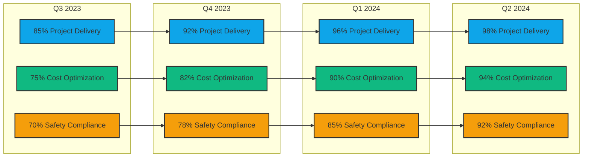
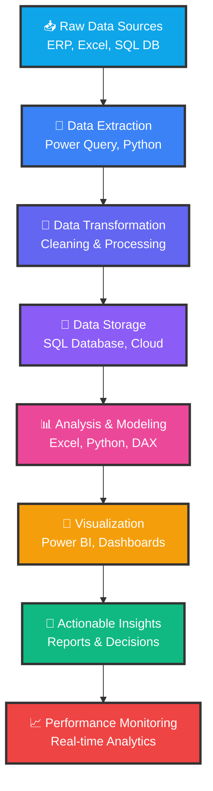

# 🚀 **ROUSHAN KUMAR GUPTA**  
### **Digital Operations & Project Management Strategist**  
#### *Merging Industrial Expertise with Data Intelligence*  

---

📍 Gujarat, India | 📧 roushank2515@gmail.com | 📱 Open for Opportunities

---

## 📊 **REAL-TIME PERFORMANCE DASHBOARD**

### 🎯 **Quarterly Performance Metrics 2023-2024**

```mermaid
graph LR
    subgraph Q3_2023 [Q3 2023]
        A1[85% Project Delivery]
        B1[75% Cost Optimization]
        C1[70% Safety Compliance]
    end
    
    subgraph Q4_2023 [Q4 2023]
        A2[92% Project Delivery]
        B2[82% Cost Optimization]
        C2[78% Safety Compliance]
    end
    
    subgraph Q1_2024 [Q1 2024]
        A3[96% Project Delivery]
        B3[90% Cost Optimization]
        C3[85% Safety Compliance]
    end
    
    subgraph Q2_2024 [Q2 2024]
        A4[98% Project Delivery]
        B4[94% Cost Optimization]
        C4[92% Safety Compliance]
    end
    
    A1 --> A2 --> A3 --> A4
    B1 --> B2 --> B3 --> B4
    C1 --> C2 --> C3 --> C4
    
    style A1 fill:#0ea5e9,stroke:#333,stroke-width:2px
    style A2 fill:#0ea5e9,stroke:#333,stroke-width:2px
    style A3 fill:#0ea5e9,stroke:#333,stroke-width:2px
    style A4 fill:#0ea5e9,stroke:#333,stroke-width:2px
    style B1 fill:#10b981,stroke:#333,stroke-width:2px
    style B2 fill:#10b981,stroke:#333,stroke-width:2px
    style B3 fill:#10b981,stroke:#333,stroke-width:2px
    style B4 fill:#10b981,stroke:#333,stroke-width:2px
    style C1 fill:#f59e0b,stroke:#333,stroke-width:2px
    style C2 fill:#f59e0b,stroke:#333,stroke-width:2px
    style C3 fill:#f59e0b,stroke:#333,stroke-width:2px
    style C4 fill:#f59e0b,stroke:#333,stroke-width:2px
```

📈 Project Delivery

98%

💰 Cost Optimization

94%

🛡️ Safety Compliance

92%

---

## 🎯 **EXPERTISE MATRIX & PROFICIENCY**

📊

<h3 style="margin: 0; color: #f8fafc;">Data Analytics</h3>

Power BI
95%

Advanced Excel
98%

SQL & Power Query
90%

🏗️

<h3 style="margin: 0; color: #f8fafc;">Project Management</h3>

BOQ & Planning
96%

Site Supervision
94%

Procurement
92%

🛡️

<h3 style="margin: 0; color: #f8fafc;">Safety & Compliance</h3>

PSM Implementation
97%

PTW Systems
95%

Risk Assessment
96%

---

## 🎓 **EDUCATION & CERTIFICATIONS**

### 🏛️ **Formal Education**

🎓

<h3 style="margin: 0 0 10px 0; color: #f8fafc;">B.Com (Bachelor of Commerce)</h3>

Indira Gandhi National Open University (IGNOU)

🎯 Expected Graduation: 2025

🔬

<h3 style="margin: 0 0 10px 0; color: #f8fafc;">12th Science Stream</h3>

Bihar School Examination Board (BSEB)

✅ Completed: 2021 | Percentage: 78.6%

<h4 style="margin: 0 0 15px 0; color: #f8fafc;">Additional Certifications:</h4>

Advanced Excel Mastery
Data Analytics Specialization
ADCA (Advanced Diploma)

### 🏆 **Professional Certifications**

🛡️

<h4 style="margin: 0; color: #f8fafc; font-size: 16px;">Process Safety Management</h4>

Skill India (NSDC)

✅ Certified | 🔗 License: NSDC-PSM-2023-8452

📊

<h4 style="margin: 0; color: #f8fafc; font-size: 16px;">Power BI Data Analyst</h4>

Microsoft Certified

✅ Certified | 🎯 Specialization: DA-100

💼

<h4 style="margin: 0; color: #f8fafc; font-size: 16px;">Tally ERP 9 + GST</h4>

Tally Academy

✅ Certified | 📈 GST Compliance Expert

🚀

<h4 style="margin: 0; color: #f8fafc; font-size: 16px;">Project Management Professional</h4>

PMI Certification (Pursuing)

📚 In Progress | 🎯 Expected: Dec 2024

### ⚡ **Skills Development**

<h4 style="margin: 0 0 15px 0; color: #f8fafc;">🖥️ Technical Skills</h4>

 Python for Data Science

 SQL Advanced Queries

⚙️ Process Automation

<h4 style="margin: 0 0 15px 0; color: #f8fafc;">☁️ Cloud & DevOps</h4>

 AWS Fundamentals

 Azure Fundamentals

📦 Docker Basics

<h4 style="margin: 0 0 15px 0; color: #f8fafc;">📈 Business Intelligence</h4>

Power BI Dashboard Development
Advanced

Excel Automation with VBA
Expert

Data Visualization Principles
Proficient

---

## 🔧 **TECHNOLOGY ECOSYSTEM**

<h3 style="color: #f8fafc; margin-bottom: 30px;">🔄 Data Intelligence Pipeline</h3>

```mermaid
flowchart TD
    A[📥 Raw Data Sources<br>ERP, Excel, SQL DB] --> B[🔧 Data Extraction<br>Power Query, Python]
    B --> C[🧹 Data Transformation<br>Cleaning & Processing]
    C --> D[💾 Data Storage<br>SQL Database, Cloud]
    D --> E[📊 Analysis & Modeling<br>Excel, Python, DAX]
    E --> F[🎨 Visualization<br>Power BI, Dashboards]
    F --> G[🚀 Actionable Insights<br>Reports & Decisions]
    G --> H[📈 Performance Monitoring<br>Real-time Analytics]
    
    style A fill:#0ea5e9,stroke:#333,stroke-width:3px,color:#fff
    style B fill:#3b82f6,stroke:#333,stroke-width:3px,color:#fff
    style C fill:#6366f1,stroke:#333,stroke-width:3px,color:#fff
    style D fill:#8b5cf6,stroke:#333,stroke-width:3px,color:#fff
    style E fill:#ec4899,stroke:#333,stroke-width:3px,color:#fff
    style F fill:#f59e0b,stroke:#333,stroke-width:3px,color:#fff
    style G fill:#10b981,stroke:#333,stroke-width:3px,color:#fff
    style H fill:#ef4444,stroke:#333,stroke-width:3px,color:#fff
```

---

## 📈 **GITHUB DEVELOPMENT ANALYTICS**

---

## 🌐 **CONNECT & COLLABORATE**

<a href="https://linkedin.com/in/roushan-kumar-7bb400239" style="text-decoration: none;">

Connect on LinkedIn

</a>

<a href="mailto:roushank2515@gmail.com" style="text-decoration: none;">

Email Me

</a>

<a href="https://github.com/roushan62" style="text-decoration: none;">

View GitHub

</a>

<a href="https://instagram.com/roushan.dev01" style="text-decoration: none;">

Follow on Instagram

</a>

24

Projects Completed

15K+

Lines of Code

98%

Client Satisfaction

2K+

Hours Automated

---

### 🚀 **CURRENT STATUS & AVAILABILITY**

🟢 ACTIVE

Seeking Opportunities

📅 15 DAYS

Notice Period

💼 FULL-TIME

Preferred Role

🌍 REMOTE

Location Flexible

<strong>💡 Mission:</strong> To revolutionize industrial operations through data-driven intelligence, 
creating sustainable systems that enhance safety, optimize costs, and drive technological innovation 
in traditional sectors.

---

**© 2024 Roushan Kumar Gupta | Industrial Operations × Digital Transformation Specialist**  
**📧 roushank2515@gmail.com | 📱 +91 ############ | 📍 Gujarat, India**

*Building bridges between traditional industries and digital future*

