# 🚀 **ROUSHAN KUMAR GUPTA**  
## **OPERATIONS EXCELLENCE ARCHITECT**  
### *Industrial Intelligence × Digital Transformation × Strategic Leadership*

---

<!-- Animated Header Banner -->
<svg width="800" height="120" viewBox="0 0 800 120" xmlns="http://www.w3.org/2000/svg">
  <defs>
    <linearGradient id="gradient" x1="0%" y1="0%" x2="100%" y2="0%">
      <stop offset="0%" style="stop-color:#0ea5e9;stop-opacity:1" />
      <stop offset="50%" style="stop-color:#8b5cf6;stop-opacity:1" />
      <stop offset="100%" style="stop-color:#10b981;stop-opacity:1" />
    </linearGradient>
    <filter id="shadow" x="-20%" y="-20%" width="140%" height="140%">
      <feGaussianBlur stdDeviation="10" result="blur"/>
      <feFlood flood-color="#0ea5e9" flood-opacity="0.5"/>
      <feComposite in2="blur" operator="in"/>
      <feMerge>
        <feMergeNode/>
        <feMergeNode in="SourceGraphic"/>
      </feMerge>
    </filter>
  </defs>
  
  <rect width="800" height="120" rx="20" fill="url(#gradient)" filter="url(#shadow)"/>
  
  <text x="400" y="50" text-anchor="middle" fill="white" font-family="Arial, sans-serif" font-size="28" font-weight="bold">
    Roushan Kumar Gupta
  </text>
  <text x="400" y="80" text-anchor="middle" fill="rgba(255,255,255,0.9)" font-family="Arial, sans-serif" font-size="16">
    Engineering Operations through Data & Technology
  </text>
</svg>

---

## 📊 **STRATEGIC OPERATIONS COMMAND CENTER**

```mermaid
graph TB
    subgraph "📈 PERFORMANCE ANALYTICS"
        A[Project Pipeline] --> B[Cost Analysis]
        B --> C[Resource Allocation]
        C --> D[Risk Assessment]
        D --> E[Real-time Monitoring]
    end
    
    subgraph "⚙️ PROCESS AUTOMATION"
        F[Data Collection] --> G[ETL Processing]
        G --> H[Dashboard Creation]
        H --> I[Decision Support]
        I --> J[Automated Actions]
    end
    
    subgraph "🛡️ COMPLIANCE FRAMEWORK"
        K[Safety Protocols] --> L[Quality Checks]
        L --> M[Audit Trails]
        M --> N[Regulatory Reporting]
    end
    
    E & J & N --> O[🎯 OPERATIONAL EXCELLENCE]
    
    style O fill:#10b981,stroke:#fff,stroke-width:3px,color:#fff
    style A fill:#3b82f6,stroke:#fff,stroke-width:2px,color:#fff
    style F fill:#8b5cf6,stroke:#fff,stroke-width:2px,color:#fff
    style K fill:#f59e0b,stroke:#fff,stroke-width:2px,color:#fff
```

---

## 🎯 **EXPERTISE QUADRANT ANALYSIS**

<h3 style="color: #0ea5e9; margin-bottom: 20px;">🏗️ INDUSTRIAL OPERATIONS</h3>

Project Management

95%

Site Supervision

92%

Safety Compliance

98%

<h3 style="color: #8b5cf6; margin-bottom: 20px;">💻 DIGITAL TRANSFORMATION</h3>

Data Analytics

90%

ERP Systems

88%

Process Automation

92%

<h3 style="color: #10b981; margin-bottom: 20px;">📈 STRATEGIC LEADERSHIP</h3>

Cost Optimization

94%

Team Leadership

89%

Strategic Planning

91%

---

## 🔧 **TECHNOLOGY INNOVATION HUB**

<!-- Data Analytics Card -->

📊

<h3 style="color: #0ea5e9; margin: 10px 0;">Data Analytics</h3>

Power BI | SQL | Advanced Excel | Python 
Real-time dashboards | Predictive analytics

<!-- ERP Systems Card -->

🏢

<h3 style="color: #8b5cf6; margin: 10px 0;">ERP Systems</h3>

Tally ERP 9 | SAP | Odoo | Zoho 
End-to-end business automation

<!-- Process Automation Card -->

⚡

<h3 style="color: #10b981; margin: 10px 0;">Process Automation</h3>

Power Automate | Python Scripts | VBA 
Workflow optimization | Efficiency boost

<!-- Cloud Integration Card -->

☁️

<h3 style="color: #f59e0b; margin: 10px 0;">Cloud Integration</h3>

AWS | Azure | Google Cloud 
Scalable solutions | Secure deployments

---

## 🏆 **FLAGSHIP PROJECTS PORTFOLIO**

<!-- Project 1 -->

🏭

<h3 style="margin: 0; color: white;">Industrial Operations Dashboard</h3>

Real-time monitoring for 15+ sites

Comprehensive dashboard integrating Power BI with IoT sensors for real-time monitoring of industrial operations, reducing downtime by 35% and improving decision-making speed by 60%.

Power BI
SQL
IoT Sensors
Real-time Analytics

<!-- Project 2 -->

🔄

<h3 style="margin: 0; color: white;">ERP Migration & Integration</h3>

Tally to Zoho One transition

Seamless migration of legacy systems to modern ERP platform, automating 70+ business processes and achieving 40% cost reduction through optimized workflows and reduced manual interventions.

Zoho One
Tally ERP
API Integration
Process Automation

<!-- Project 3 -->

🛡️

<h3 style="margin: 0; color: white;">Safety Compliance Intelligence</h3>

Zero-incident safety framework

Advanced safety monitoring system integrating PTW, risk assessments, and real-time compliance tracking. Achieved 100% safety record across 50+ projects through predictive risk analysis.

Power Apps
SharePoint
Risk Analytics
Compliance Tracking

---

## 📈 **CAREER PROGRESSION TIMELINE**

---

## 🎓 **EDUCATION & CERTIFICATION FRAMEWORK**

<h3 style="color: #0ea5e9; border-bottom: 2px solid #0ea5e9; padding-bottom: 10px; margin-bottom: 20px;">🎓 Academic Credentials</h3>
<ul style="list-style: none; padding: 0;">
<li style="margin-bottom: 15px; padding-left: 25px; position: relative;">

🎯

<strong style="color: white;">B.Com (Commerce)</strong> 
IGNOU | Expected 2025
</li>
<li style="margin-bottom: 15px; padding-left: 25px; position: relative;">

🎯

<strong style="color: white;">12th Science (PCM)</strong> 
Bihar School Examination Board | 2021
</li>
<li style="margin-bottom: 15px; padding-left: 25px; position: relative;">

🎯

<strong style="color: white;">Advanced Diploma in Computer Applications</strong> 
NSDC Certified
</li>
</ul>

<h3 style="color: #8b5cf6; border-bottom: 2px solid #8b5cf6; padding-bottom: 10px; margin-bottom: 20px;">🏅 Professional Certifications</h3>
<ul style="list-style: none; padding: 0;">
<li style="margin-bottom: 15px; padding-left: 25px; position: relative;">

📜

<strong style="color: white;">Process Safety Management (PSM)</strong> 
Skill India | NSDC
</li>
<li style="margin-bottom: 15px; padding-left: 25px; position: relative;">

📜

<strong style="color: white;">Microsoft Power BI Data Analyst</strong> 
Microsoft Certified
</li>
<li style="margin-bottom: 15px; padding-left: 25px; position: relative;">

📜

<strong style="color: white;">Tally ERP 9 + GST Certification</strong> 
Tally Solutions
</li>
<li style="margin-bottom: 15px; padding-left: 25px; position: relative;">

📜

<strong style="color: white;">Advanced Excel for Business</strong> 
Microsoft Office Specialist
</li>
</ul>

---

## 🌐 **DIGITAL PRESENCE NETWORK**

<!-- LinkedIn -->
<a href="https://linkedin.com/in/roushan-kumar-7bb400239" style="text-decoration: none;">

💼

<h4 style="color: white; margin: 0;">LinkedIn</h4>

Professional Network

</a>

<!-- GitHub -->
<a href="https://github.com/roushan62" style="text-decoration: none;">

💻

<h4 style="color: white; margin: 0;">GitHub</h4>

Code Repository

</a>

<!-- Email -->
<a href="mailto:roushank2515@gmail.com" style="text-decoration: none;">

📧

<h4 style="color: white; margin: 0;">Email</h4>

Direct Contact

</a>

<!-- Portfolio -->
<a href="https://roushan62.github.io" style="text-decoration: none;">

🌐

<h4 style="color: white; margin: 0;">Portfolio</h4>

Showcase

</a>

---

## 📊 **GITHUB INTELLIGENCE DASHBOARD**

<!-- Stats Card -->

<h3 style="color: #0ea5e9; margin-bottom: 20px;">📈 GitHub Analytics</h3>

50+

Repositories

100+

Commits

15+

Projects

<!-- Streak Card -->

<h3 style="color: #8b5cf6; margin-bottom: 20px;">🔥 Contribution Streak</h3>

365+ Days

Consistent Coding Activity

Current Streak: 85%

<!-- Languages Card -->

<h3 style="color: #10b981; margin-bottom: 20px;">💻 Tech Stack</h3>

Power BI
SQL
Python
Excel
VBA
JavaScript

---

## 🎯 **STRATEGIC POSITIONING**

<h2 style="color: white; margin-bottom: 20px;">🌟 Value Proposition</h2>

⚡

<h4 style="color: white; margin: 10px 0;">Operational Efficiency</h4>

25-40% cost reduction through process optimization

📊

<h4 style="color: white; margin: 10px 0;">Data-Driven Decisions</h4>

Real-time analytics for strategic insights

🛡️

<h4 style="color: white; margin: 10px 0;">Risk Mitigation</h4>

100% safety compliance and zero incidents

🚀

<h4 style="color: white; margin: 10px 0;">Digital Transformation</h4>

Modernizing legacy systems for future readiness

---

<footer align="center" style="margin-top: 50px; padding: 30px; background: linear-gradient(90deg, #0f172a 0%, #1e293b 100%); border-radius: 20px; border-top: 3px solid #0ea5e9;">

Let's Build the Future Together

<a href="mailto:roushank2515@gmail.com" style="background: linear-gradient(135deg, #0ea5e9, #3b82f6); color: white; padding: 12px 30px; border-radius: 25px; text-decoration: none; font-weight: bold; display: inline-flex; align-items: center; gap: 10px;">
📧 Contact Me
</a>
<a href="https://linkedin.com/in/roushan-kumar-7bb400239" style="background: linear-gradient(135deg, #0077b5, #00a0dc); color: white; padding: 12px 30px; border-radius: 25px; text-decoration: none; font-weight: bold; display: inline-flex; align-items: center; gap: 10px;">
💼 Connect on LinkedIn
</a>

© 2024 Roushan Kumar Gupta | Operations & Project Management Executive 
Last Updated: January 2024 | Version 4.0 | Neo-Industrial Design

<small style="color: #64748b;">"Transforming Industrial Operations through Digital Innovation"</small>

</footer>

<!-- Visitor Counter -->

